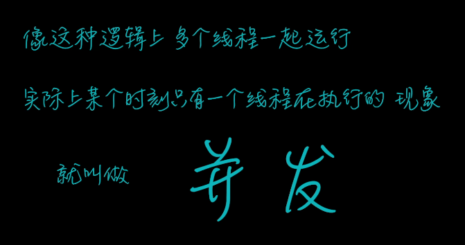
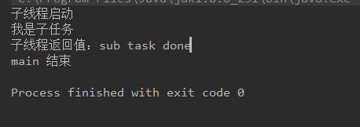
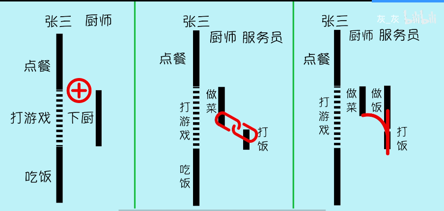
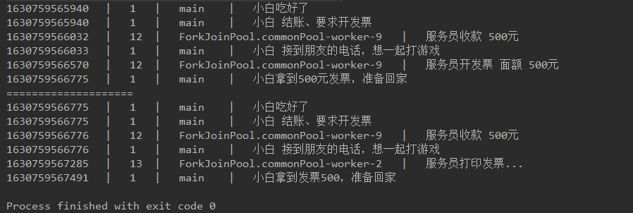
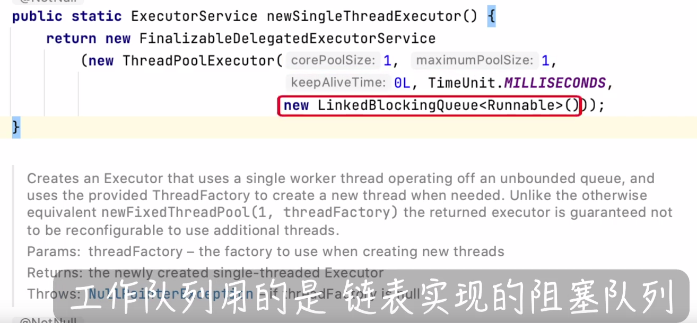
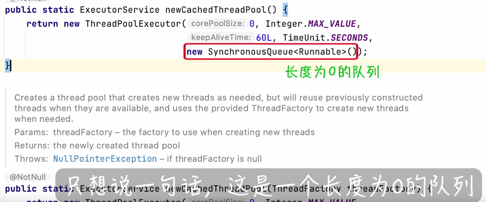

### 多线程学习： 


[参考视频](https://www.bilibili.com/video/BV1Wa4y1H7c7)

h学习多线程： 


`并发`： 单核单线程得cpu执行 多个程序， 快速切换以让多个程序执行，但实际只有一个线程在运行中。



`并行`： 多核多线程得cpu同时执行多个程序。


#### 02 创建线程

##### 初识Java线程状态

##### new -> runnable -> terminated

- new() 创建新线程 则在堆中创建线程对象，此时状态为new

- start() 则线程进入runnable状态，加入到栈中，等待cpu的执行

- 线程执行结束则 进入terminated 状态


线程状体可以通过getState() 方法获取状态

案例：

```java
public class LearnThread {

    public static void main(String[] args) throws InterruptedException {
        Thread thread = new Thread();
        System.out.println("1 -> " + thread.getState());
        thread.start();
        System.out.println("2 -> " + thread.getState());
        TimeUnit.SECONDS.sleep(1);
        System.out.println("3 -> " + thread.getState());
    }
}
```

出现结果：


##### 把任务告诉线程的方式一共有3种


###### **01_ 重写Thread的run() 方法**

```java
public class LearnThread_02 {
    public static void main(String[] args) {
        Thread thread = new Thread(){
            @Override
            public void run() {
                System.out.println("我是子线程");
            }
        };

        thread.start();
        System.out.println("main 结束");

    }
}
```

执行结果：


执行过程：


###### **02_创建线程时，传入Runnable对象**

```java
public class LearnThread_02_B {
    public static void main(String[] args) {
        Thread thread = new Thread(
                () -> System.out.println("我是子线程")
        );

        thread.start();
        System.out.println("main 结束");

    }
}
```

执行结果：


执行过程


前两种方式本质都是一样的， 调用Thread类中的run 方法， 无非一个重写，一个是以对象形式进行调用。


###### **03_ 使用FutureTask，在创建Thread对象的时候传进去**

FutureTask 其实就是Runnable 类的子类，所以跟第二种方式是一样的。

不过拥有了返回值也可以抛出异常，

所以是封装了线程间的通信。

案例：

```java
public class _03_CreateThread_FutureTask {
    public static void main(String[] args) {
        Callable<String> callable = () -> {
            System.out.println("我是子任务");
            return "sub task done";
        };
        FutureTask<String> task = new FutureTask(callable);
        Thread thread = new Thread(task);
        thread.start();
        System.out.println("子线程启动");
        try {
            String subResult = task.get(5, TimeUnit.MINUTES);		// 获取子线程的返回值
            System.out.println("子线程返回值：" + subResult);			
        } catch (InterruptedException e) {
            e.printStackTrace();							// 线程中断异常
        } catch (ExecutionException e) {
            Throwable cause = e.getCause();					// 捕获子线程的异常
            e.printStackTrace();
        } catch (TimeoutException e) {		
            e.printStackTrace();							// 超时异常
        }
        System.out.println("main 结束");
    }
}

```

执行结果



FutureTask 使用场景， 需要多个线程同时完成才能继续往下时使用。

案例：


**FutureTask 并不常用。可以全部忘记** 

因为有更好的方式实现多线程


#### 03 初识CompletableFuture 


##### 多线程状态的小工具

```java
import java.util.StringJoiner;

/**
 * 小工具
 */
public class SmallTool {

    public static void sleepMillis(long millis) {
        try {
            Thread.sleep(millis);
        } catch (InterruptedException e) {
            e.printStackTrace();
        }
    }

    public static void printTimeAndThread(String tag) {
        String result = new StringJoiner("\t|\t")
                .add(String.valueOf(System.currentTimeMillis()))
                .add(String.valueOf(Thread.currentThread().getId()))
                .add(Thread.currentThread().getName())
                .add(tag)
                .toString();
        System.out.println(result);
    }

}
```

##### 重要的Api 

###### **supplyAsyc(Supplier<U> supplier)  开启异步任务**

- supplier 接口， 没有入参， 生成返回值。
- **调用此方法会使其中的代码进入另外的线程去执行。**

###### **thenCompose(Function<? super T, ? extends CompletionStage<U>> fn) 连接两个任务**

- Function<T, R>   接口， 传入T, 返回R
- 源码中有体现： R apply(T t);
- 此方法，入参为上个方法的返回值， 出参是一个CompletionStage 的实现， 是CompletableFuture的父接口，
- 调用此方法可以实现线程的连接， 把前一个线程的结果交给下一个异步任务，
-  **注意：在前一个任务完成，有结果后，下一个任务才会触发。**

###### **thenCombine( CompletionStage<? extends U> other, **BiFunction<? super T,? super U,? extends V> fn）合并两个任务

- 把上一个任务与这个任务一起执行，等两个任务都执行完成之后，得到两个结果，
- 然后使用BiFunction 函数 将两个结果加工为一个结果进行输出。

###### **join()**  

- 获取CompletableFuture的返回值

###### **get()** 

- 获取CompletableFuture的返回值

###### join() 与 get() 的异同

一.**相同点**：

>  join()和get()方法都是用来获取CompletableFuture异步之后的返回值

二.**区别**：

> 1.join()方法抛出的是uncheck异常（即未经检查的异常),不会强制开发者抛出，
>
> 会将异常包装成CompletionException异常 /CancellationException异常，但是本质原因还是代码内存在的真正的异常，
>
> 2.get()方法抛出的是经过检查的异常，ExecutionException, InterruptedException 需要用户手动处理（抛出或者 try catch）

　　

　　文档说明：

###### 01_supplyAsyn 异步任务的开始

场景描述： 小白进入餐厅，点菜，然后打游戏，上菜吃饭

```java
public class _01_supplyAsync {
    public static void main(String[] args) {
        SmallTool.printTimeAndThread("小白进入餐厅");
        SmallTool.printTimeAndThread("小白点了 番茄炒蛋 + 一碗米饭");

        CompletableFuture<String> cf1 = CompletableFuture.supplyAsync(() -> {
            SmallTool.printTimeAndThread("厨师炒菜");
            SmallTool.sleepMillis(200);
            SmallTool.printTimeAndThread("厨师打饭");
            SmallTool.sleepMillis(100);
            return "番茄炒蛋 + 米饭 做好了";
        });

        SmallTool.printTimeAndThread("小白在打王者");
        SmallTool.printTimeAndThread(String.format("%s ,小白开吃", cf1.join()));
    }
}

```

执行结果：


###### 02_thenCompose  异步任务的连接

场景描述： 小白进入餐厅，点菜，坐下打游戏，厨师炒菜，炒完之后让服务行打饭并交给小白，小白吃饭

```java
public class _02_thenCompose {
    public static void main(String[] args) {
        SmallTool.printTimeAndThread("小白进入餐厅");
        SmallTool.printTimeAndThread("小白点了 番茄炒蛋 + 一碗米饭");

        CompletableFuture<String> cf1 = CompletableFuture.supplyAsync(() -> {
            SmallTool.printTimeAndThread("厨师炒菜");
            SmallTool.sleepMillis(200);
            return "番茄炒蛋";
        }).thenCompose(dish -> CompletableFuture.supplyAsync(() -> {
            SmallTool.printTimeAndThread("服务员打饭");
            SmallTool.sleepMillis(100);
            return dish + " + 米饭";
        }));

        SmallTool.printTimeAndThread("小白在打王者");
        SmallTool.printTimeAndThread(String.format("%s 好了,小白开吃", cf1.join()));
    }

    /**
     * 用 applyAsync 也能实现
     */
    private static void applyAsync() {
        SmallTool.printTimeAndThread("小白进入餐厅");
        SmallTool.printTimeAndThread("小白点了 番茄炒蛋 + 一碗米饭");

        CompletableFuture<String> cf1 = CompletableFuture.supplyAsync(() -> {
            SmallTool.printTimeAndThread("厨师炒菜");
            SmallTool.sleepMillis(200);
            CompletableFuture<String> race = CompletableFuture.supplyAsync(() -> {
                SmallTool.printTimeAndThread("服务员打饭");
                SmallTool.sleepMillis(100);
                return " + 米饭";
            });
            return "番茄炒蛋" + race.join();
        });

        SmallTool.printTimeAndThread("小白在打王者");
        SmallTool.printTimeAndThread(String.format("%s 好了,小白开吃", cf1.join()));
    }
}
```

执行结果


###### 03_thenCombine 异步任务的结合

场景描述：小白进入餐厅点菜，坐下打游戏，厨师炒菜，服务员煮饭，等都做好后呈上来给小白，小白吃饭。

```java
public class _03_thenCombine {
    public static void main(String[] args) {
        SmallTool.printTimeAndThread("小白进入餐厅");
        SmallTool.printTimeAndThread("小白点了 番茄炒蛋 + 一碗米饭");

        CompletableFuture<String> cf1 = CompletableFuture.supplyAsync(() -> {
            SmallTool.printTimeAndThread("厨师炒菜");
            SmallTool.sleepMillis(200);
            return "番茄炒蛋";
        }).thenCombine(CompletableFuture.supplyAsync(() -> {
            SmallTool.printTimeAndThread("服务员蒸饭");
            SmallTool.sleepMillis(300);
            return "米饭";
        }), (dish, rice) -> {   // 运行慢的线程进行合并两个结果
            SmallTool.printTimeAndThread("服务员打饭");
            SmallTool.sleepMillis(100);
            return String.format("%s + %s 好了", dish, rice);
        });

        SmallTool.printTimeAndThread("小白在打王者");
        SmallTool.printTimeAndThread(String.format("%s ,小白开吃", cf1.join()));

    }


    /**
     * 用 applyAsync 也能实现
     */
    private static void applyAsync() {
        SmallTool.printTimeAndThread("小白进入餐厅");
        SmallTool.printTimeAndThread("小白点了 番茄炒蛋 + 一碗米饭");

        CompletableFuture<String> cf1 = CompletableFuture.supplyAsync(() -> {
            SmallTool.printTimeAndThread("厨师炒菜");
            SmallTool.sleepMillis(200);
            return "番茄炒蛋";
        });
        CompletableFuture<String> race = CompletableFuture.supplyAsync(() -> {
            SmallTool.printTimeAndThread("服务员蒸饭");
            SmallTool.sleepMillis(300);
            return "米饭";
        });
        SmallTool.printTimeAndThread("小白在打王者");

        String result = String.format("%s + %s 好了", cf1.join(), race.join());
        SmallTool.printTimeAndThread("服务员打饭");
        SmallTool.sleepMillis(100);

        SmallTool.printTimeAndThread(String.format("%s ,小白开吃", result));
    }
}

```

执行结果


三个例子： 好好看



**异步任务的开始：                                   异步任务的连接：                                         异步任务的结合：**


#### 04 CompletableFuture 进阶

##### 重要的Api

###### thenApply(Function<? super T,? extends U> fn)  异步任务的后续处理。转换结果，相当于stream中的map映射

**直接使用thenApply 则 JVM 会将两块代码块当作一个任务进行执行 ，**

**使用thenApplyAsyn 作用与 thenCompose 相当，可以作用于异步任务的连接**

**关于thenApply 与 thenCompose 的区别，** 

thenCompose 相当于 stream流中 flatMap（）

thenApply()  相当于 stram流中的Map()

​	专栏 [](https://blog.csdn.net/winterking3/article/details/116026768)
​			

>  thenApply（）转换的是泛型中的类型，是同一个CompletableFuture，相当于将CompletableFuture<T> 转换成CompletableFuture<U>
>
> thenCompose（）用来连接两个CompletableFuture，是生成一个新的CompletableFuture。


###### applyToEither( CompletionStage<? extends T> other, Function<? super T, U> fn)  选择一个异步任务的结果

**两个异步任务同时执行，先执行成功的进入function 函数中进行处理并返回。**

###### exceptionally (Function<Throwable, ? extends T> fn)  优雅的处理异步任务的结果


###### 01_thenApply   任务的后置处理

场景再现： 小白吃完饭，服务员 付款结账开发票，同时接电话，收好发票回家


```java

public class _01_thenApply {
    public static void main(String[] args) {
        SmallTool.printTimeAndThread("小白吃好了");
        SmallTool.printTimeAndThread("小白 结账、要求开发票");

        CompletableFuture<String> invoice = CompletableFuture.supplyAsync(() -> {
            SmallTool.printTimeAndThread("服务员收款 500元");
            SmallTool.sleepMillis(500);
            return "500";
        }).thenApplyAsync(money -> {
            SmallTool.printTimeAndThread(String.format("服务员开发票 面额 %s元", money));
            SmallTool.sleepMillis(200);
            return String.format("%s元发票", money);
        });

        SmallTool.printTimeAndThread("小白 接到朋友的电话，想一起打游戏");

        SmallTool.printTimeAndThread(String.format("小白拿到%s，准备回家", invoice.join()));

        System.out.println("====================");
        three();
    }

    // 使用thenCompose 实现
    private static void three() {
        SmallTool.printTimeAndThread("小白吃好了");
        SmallTool.printTimeAndThread("小白 结账、要求开发票");

        CompletableFuture<String> invoice = CompletableFuture.supplyAsync(() -> {
            SmallTool.printTimeAndThread("服务员收款 500元");
            SmallTool.sleepMillis(500);
            return "500";
        }).thenCompose(money -> CompletableFuture.supplyAsync(() -> {
            SmallTool.printTimeAndThread("服务员打印发票...");
            SmallTool.sleepMillis(200);
            return "发票" + money;
        }));

        SmallTool.printTimeAndThread("小白 接到朋友的电话，想一起打游戏");

        SmallTool.printTimeAndThread(String.format("小白拿到%s，准备回家", invoice.join()));


    }


    private static void one() {
        SmallTool.printTimeAndThread("小白吃好了");
        SmallTool.printTimeAndThread("小白 结账、要求开发票");

        CompletableFuture<String> invoice = CompletableFuture.supplyAsync(() -> {
            SmallTool.printTimeAndThread("服务员收款 500元");
            SmallTool.sleepMillis(100);
            SmallTool.printTimeAndThread("服务员开发票 面额 500元");
            SmallTool.sleepMillis(200);
            return "500元发票";
        });

        SmallTool.printTimeAndThread("小白 接到朋友的电话，想一起打游戏");

        SmallTool.printTimeAndThread(String.format("小白拿到%s，准备回家", invoice.join()));
    }


    private static void two() {
        SmallTool.printTimeAndThread("小白吃好了");
        SmallTool.printTimeAndThread("小白 结账、要求开发票");

        CompletableFuture<String> invoice = CompletableFuture.supplyAsync(() -> {
            SmallTool.printTimeAndThread("服务员收款 500元");
            SmallTool.sleepMillis(100);

            CompletableFuture<String> waiter2 = CompletableFuture.supplyAsync(() -> {
                SmallTool.printTimeAndThread("服务员开发票 面额 500元");
                SmallTool.sleepMillis(200);
                return "500元发票";
            });

            return waiter2.join();
        });

        SmallTool.printTimeAndThread("小白 接到朋友的电话，想一起打游戏");

        SmallTool.printTimeAndThread(String.format("小白拿到%s，准备回家", invoice.join()));
    }
}

```

执行结果：




###### 02_applyToEither 获取最先完成的任务

场景再现： 小白吃完饭坐公交回家，哪个先到坐哪辆

```java

public class _02_applyToEither {
    public static void main(String[] args) {
        SmallTool.printTimeAndThread("张三走出餐厅，来到公交站");
        SmallTool.printTimeAndThread("等待 700路 或者 800路 公交到来");

        CompletableFuture<String> bus = CompletableFuture.supplyAsync(() -> {
            SmallTool.printTimeAndThread("700路公交正在赶来");
            SmallTool.sleepMillis(100);
            return "700路到了";
        }).applyToEither(CompletableFuture.supplyAsync(() -> {
            SmallTool.printTimeAndThread("800路公交正在赶来");
            SmallTool.sleepMillis(200);
            return "800路到了";
        }), firstComeBus -> firstComeBus);

        SmallTool.printTimeAndThread(String.format("%s,小白坐车回家", bus.join()));
    }
}

```

运行结果


###### 03_exceptionally 异步任务中的异常处理

```java

public class _03_exceptionally {
    public static void main(String[] args) {
        SmallTool.printTimeAndThread("张三走出餐厅，来到公交站");
        SmallTool.printTimeAndThread("等待 700路 或者 800路 公交到来");

        CompletableFuture<String> bus = CompletableFuture.supplyAsync(() -> {
            SmallTool.printTimeAndThread("700路公交正在赶来");
            SmallTool.sleepMillis(100);
            return "700路到了";
        }).applyToEither(CompletableFuture.supplyAsync(() -> {
            SmallTool.printTimeAndThread("800路公交正在赶来");
            SmallTool.sleepMillis(200);
            return "800路到了";
        }), firstComeBus -> {
            SmallTool.printTimeAndThread(firstComeBus);
            if (firstComeBus.startsWith("700")) {
                throw new RuntimeException("撞树了……");
            }
            return firstComeBus;
        }).exceptionally(e -> {
            SmallTool.printTimeAndThread(e.getMessage());	// 获取异步任务的异常。
            SmallTool.printTimeAndThread("小白叫出租车");
            return "出租车 叫到了";
        });

        SmallTool.printTimeAndThread(String.format("%s,小白坐车回家", bus.join()));
    }
}

```

执行结果


#### 05 CompletableFuture 扩展

###### api 特性

- xxx(args)							普通方法

- xxxAsyn(args)               异步方法

- xxxAsyn(args, Executor executor)         带有线程池的异步方法


###### 有关**thenCompose** 的说法、

在03初始CompletableFuture 中 讲到过 此api是将两个异步任务连接。

那 thenComposeAsyn 呢

场景再现： 厨师炒菜，让服务员A去打饭，结果服务员A被老板叫走，让服务员B打饭，

```java
public class _02_thenCompose {
    public static void main(String[] args) {
        CompletableFuture<String> cf1 = CompletableFuture.supplyAsync(() -> {
            SmallTool.printTimeAndThread("厨师炒菜");
            SmallTool.sleepMillis(200);
            return "番茄炒蛋";
        }).thenCompose(dish -> {
            SmallTool.printTimeAndThread("服务员A 准备打饭，但是被领导叫走，打饭交接给服务员B");

            return CompletableFuture.supplyAsync(() -> {
                SmallTool.printTimeAndThread("服 务员B 打饭");
                SmallTool.sleepMillis(100);
                return dish + " + 米饭";
            });
        });

        SmallTool.printTimeAndThread(cf1.join()+"好了，开饭");
    }
}

```

执行结果：


将 thenCompose 换成 thenComposeAsyn 

执行结果


开启了异步任务， 服务员B在12线程是因为 JVM对于线程的优化结果， 线程的复用

正确是包含了3个异步任务。


###### 其他Api

supplyAsyn 				开启异步任务 ， 有返回值

runAsyn						开启异步任务， 没有返回值


thenApply   				接收参数，并返回值

thenAccept				接收参数，没有返回值

thenRun						不接受参数，没有返回值


thenCombine 			接收两个异步任务的结果，然后处理得到一个返回值

thenAccpetBoth		接收两个异步任务的结果， 没有返回值

runAfterBoth 				不关心两个异步任务的结果，没有返回值


applyToEither			获取两个异步任务中最先执行完成的结果， 然后处理返回一个结果

acceptEithe				得到最快执行完任务的结果， 没有返回值

runAfterEither				不关心两个异步任务的结果，没有返回值


exceptionally 			处理前面异步任务的异常，并修正为正常值 再返回

handle						如果前面的线程正常执行，则收到正常执行的结果，如果线程异常，则接收异常，无论是否												异常，都会返回一个结果		 

whenComplete		跟handle 有点像， 但是没有返回值


##### 总结：

xxxAsyn 为 异步执行

带有executor 参数则 是传入线程池。


apply   有参数有返回值

accept   有参数，无返回值

run       无参数，无返回值


#### 06 线程池

线程池在 java.util.concurrent 中的 ThreadPoolExecutor

获取线程池  new ThreadPoolExecutor()


好用的线程工具类  Executors 

```java
public class _01_ThreadPool {
    public static void main(String[] args) {

        // 创建只有一个线程的线程池
        Executors.newSingleThreadExecutor();

        // 创建出最大线程池，核心线程数为0，最大线程数为最大
        Executors.newCachedThreadPool();

        // 创造出固定线程数量的线程池
        ExecutorService executorService = Executors.newFixedThreadPool(3);

    }
}
```






当任务来临，如果有空闲线程就直接去执行，如果没有空闲线程，就直接创建新的线程去执行


#### 07 CompletableFuture 性能

##### 场景再现： 小白跟朋友一起去吃饭，点菜。

```java

/**
 * 菜
 */
public class Dish {
    // 菜名
    private String name;
    // 制作时长 (秒)
    private Integer productionTime;

    public Dish(String name, Integer productionTime) {
        this.name = name;
        this.productionTime = productionTime;
    }

    // 做菜
    public void make() {
        SmallTool.sleepMillis(TimeUnit.SECONDS.toMillis(this.productionTime));
        SmallTool.printTimeAndThread(this.name + " 制作完毕，来吃我吧");
    }

    // 做菜
    public void makeUseCPU() {
        SmallTool.printTimeAndThread(this.name + " 制作完毕，来吃我吧" + compute());
    }

    /**
     * 用来模拟 1秒钟的耗时操作
     * 如果你的电脑比较强，可以增大循环次数，否则，需要减少循环次数
     */
    private static long compute() {
        long startTime = System.currentTimeMillis();
        long result = 0;
        // 只是用来模拟耗时操作，没有任何意义
        for (int i = 0; i < Integer.MAX_VALUE / 3; i++) {
            result += i * i % 3;
        }
        return System.currentTimeMillis() - startTime;
    }

    public static void main(String[] args) {
        System.out.println(compute());
    }


}

```

糟糕的做法

```java
public class _01_terribleCode {
    public static void main(String[] args) {

        SmallTool.printTimeAndThread("小白和小伙伴们 进餐厅点菜");
        long startTime = System.currentTimeMillis();

        ArrayList<Dish> dishes = new ArrayList<>();
        // 点菜
        for (int i = 1; i <= 10; i++) {
            Dish dish = new Dish("菜" + i, 1);
            dishes.add(dish);
        }
        // 做菜
        for (Dish dish : dishes) {
            CompletableFuture.runAsync(() -> dish.make()).join();
        }

        SmallTool.printTimeAndThread("菜都做好了，上桌 " + (System.currentTimeMillis() - startTime));

    }
}
```


```java
public class _02_terribleCodeImprove {
    public static void main(String[] args) {

        SmallTool.printTimeAndThread("小白和小伙伴们 进餐厅点菜");
        long startTime = System.currentTimeMillis();
        // 点菜
        ArrayList<Dish> dishes = new ArrayList<>();
        for (int i = 1; i <= 10; i++) {
            Dish dish = new Dish("菜" + i, 1);
            dishes.add(dish);
        }
        // 做菜
        ArrayList<CompletableFuture> cfList = new ArrayList<>();
        for (Dish dish : dishes) {
            CompletableFuture<Void> cf = CompletableFuture.runAsync(() -> dish.make());
            cfList.add(cf);
        }
        // 等待所有任务执行完毕
        CompletableFuture.allOf(cfList.toArray(new CompletableFuture[cfList.size()])).join();

        SmallTool.printTimeAndThread("菜都做好了，上桌 " + (System.currentTimeMillis() - startTime));

    }
}
```


```java
public class _03_goodCode {
    public static void main(String[] args) {
        //-Djava.util.concurrent.ForkJoinPool.common.parallelism=8
        System.setProperty("java.util.concurrent.ForkJoinPool.common.parallelism", "12");

        SmallTool.printTimeAndThread("小白和小伙伴们 进餐厅点菜");
        long startTime = System.currentTimeMillis();

        CompletableFuture[] dishes = IntStream.rangeClosed(1, 12)
                .mapToObj(i -> Dish("菜" + i, 1))
                .map(dish -> CompletableFuture.runAsync(dish::make))
                .toArray(size -> new CompletableFuture[size]);

        CompletableFuture.allOf(dishes).join();

        SmallTool.printTimeAndThread("菜都做好了，上桌 " + (System.currentTimeMillis() - startTime));

    }
}
```


##### 查看电脑线程数量

```java
public class _04_commonPoolSize {
    public static void main(String[] args) {

        // Returns the number of processors available to the Java virtual machine
        // 查看电脑 线程核心数量  此电脑，6核12线程
        System.out.println(Runtime.getRuntime().availableProcessors());
        // 查看 当前线程数
        System.out.println(ForkJoinPool.commonPool().getPoolSize());
        // 查看 最大线程数
        System.out.println(ForkJoinPool.getCommonPoolParallelism());

    }
}
```


##### 创建审查状态的线程池

线程执行完任务就直接销毁。方便查看各个任务的线程真实情况，防止线程的复用干扰判断。

```java
public class _06_thenRunAsync_threadReuse {
    public static void main(String[] args) {
        ThreadPoolExecutor executor = new ThreadPoolExecutor(0, Integer.MAX_VALUE,
                0, TimeUnit.MILLISECONDS,
                new SynchronousQueue<Runnable>());

        CompletableFuture.runAsync(() -> SmallTool.printTimeAndThread("A"), executor)
                .thenRunAsync(() -> SmallTool.printTimeAndThread("B"), executor)
                .join();

    }
}
```