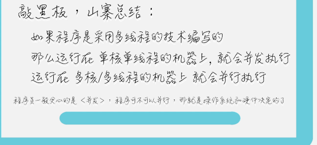
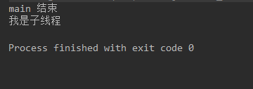

### 多线程学习： 


[参考视频](https://www.bilibili.com/video/BV1Wa4y1H7c7)

#### 01 线程基础概念

学习多线程： 


`并发`： 单核单线程得cpu执行 多个程序， 快速切换以让多个程序执行，但实际只有一个线程在运行中。


`并行`： 多核多线程得cpu同时执行多个程序。





#### 02 创建线程

初识Java线程状态

new -> runnable -> terminated

new() 创建新线程 则在堆中创建线程对象，此时状态为new

start() 则线程进入runnable状态，加入到栈中，等待cpu的执行

线程执行结束则 进入terminated 状态


线程状体可以通过getState() 方法获取状态

案例：

```java
public class LearnThread {

    public static void main(String[] args) throws InterruptedException {
        Thread thread = new Thread();
        System.out.println("1 -> " + thread.getState());
        thread.start();
        System.out.println("2 -> " + thread.getState());
        TimeUnit.SECONDS.sleep(1);
        System.out.println("3 -> " + thread.getState());
    }
}
```

出现结果：


把任务告诉线程的方式一共有3种


**01_ 重写Thread的run() 方法**

```java
public class LearnThread_02 {
    public static void main(String[] args) {
        Thread thread = new Thread(){
            @Override
            public void run() {
                System.out.println("我是子线程");
            }
        };

        thread.start();
        System.out.println("main 结束");

    }
}
```

执行结果：



执行过程：


**02_创建线程时，传入Runnable对象**

```java
public class LearnThread_02_B {
    public static void main(String[] args) {
        Thread thread = new Thread(
                () -> System.out.println("我是子线程")
        );

        thread.start();
        System.out.println("main 结束");

    }
}
```

执行结果：


执行过程


前两种方式本质都是一样的， 调用Thread类中的run 方法， 无非一个重写，一个是以对象形式进行调用。


**03_ 使用FutureTask，在创建Thread对象的时候传进去**

FutureTask 其实就是Runnable 类的子类，所以跟第二种方式是一样的。

不过拥有了返回值也可以抛出异常，

所以是封装了线程间的通信。

案例：

```java
public class LearnThread_02_C {
    public static void main(String[] args) {

        Callable<String> callable = () -> {
            System.out.println("子线程");
            return "thread T";
        };
        FutureTask<String> task = new FutureTask(callable);
        Thread thread = new Thread(task);
        thread.start();
        // 获取子线程中的返回值与异常
        String s = null;
        try {
            s = task.get();                             // 获取线程中的返回值
            System.out.println("s = " + s);
        } catch (InterruptedException e) {
            e.printStackTrace();
        } catch (ExecutionException e) {
            Throwable cause = e.getCause();             // 获取抛出的异常
            e.printStackTrace();
        }
        System.out.println("main 结束");

    }
}
```

FutureTask 使用场景， 需要多个线程同时完成才能继续往下时使用。

案例：


FutureTask 并不常用。


