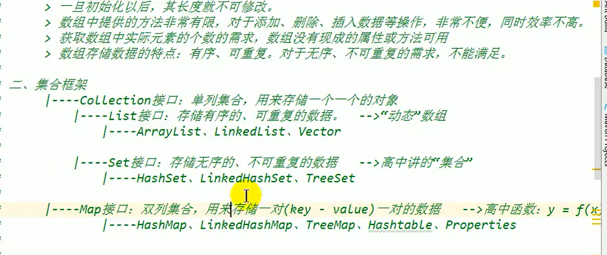

**集合中的contains 方法是依靠equals() 方法进行对比的。**

**removeAll(Collection coll)  取当前集合的差集**

**retainAll(Collection coll)  取当前集合的交集。**

**equals()  比较两个集合内容是否一致，每个元素进行equals**

****

----


快速生成集合的方式

数组---> 集合

```java

List<String> list = Arrays.asList(new String[]{"123","456","abc"});

// 谨慎一点：
List<int[]> list = Arrays.asList(new int[]{1,2,3});
// 此时，集合中存放的int[] 数组的集合， 不是数组元素的集合。

// 这样是元素
List<Integer> list = Arrays.asList(new Integer[]{1,2,3});
List<Integer> list = Arrays.asList(1,2,3,4);

 
```


集合---> 数组

```java
Object[] arr = list.toArray();
```


