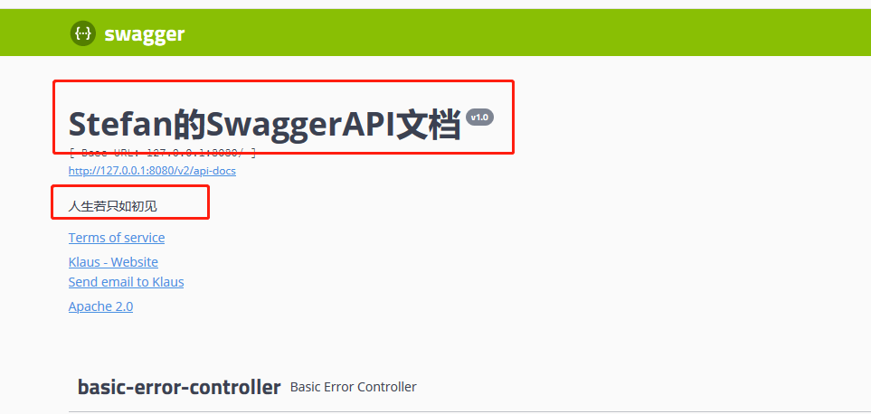
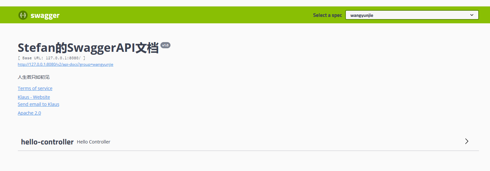
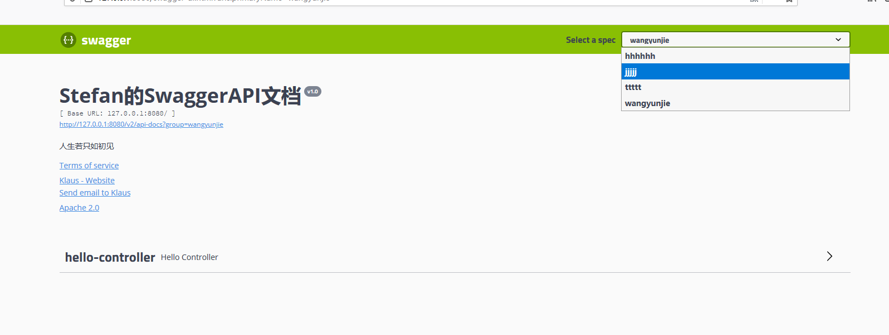
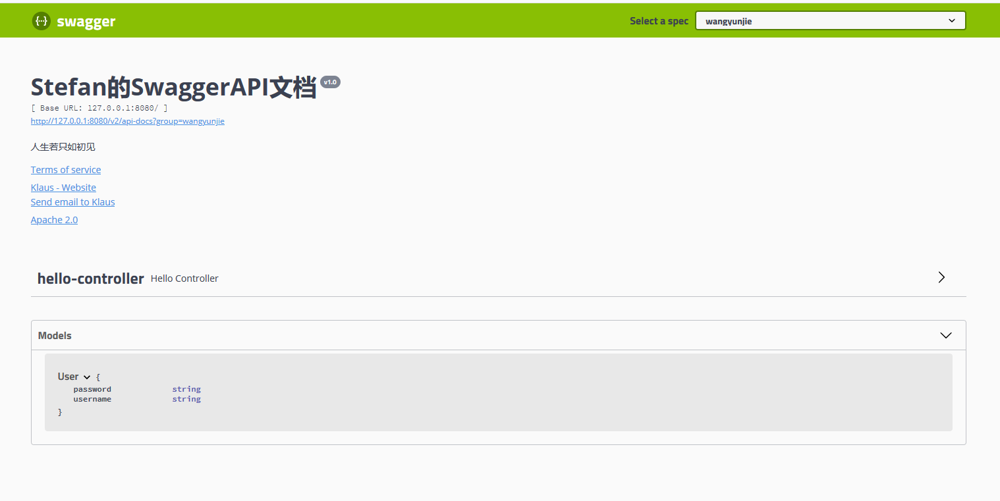
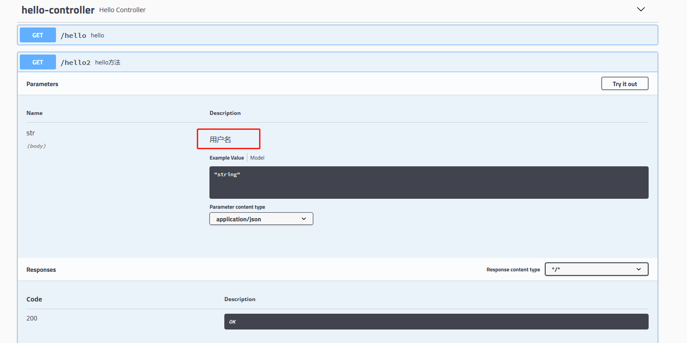
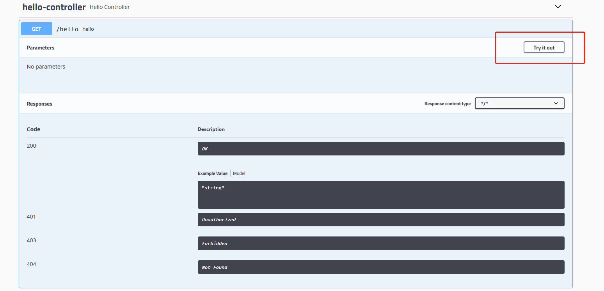
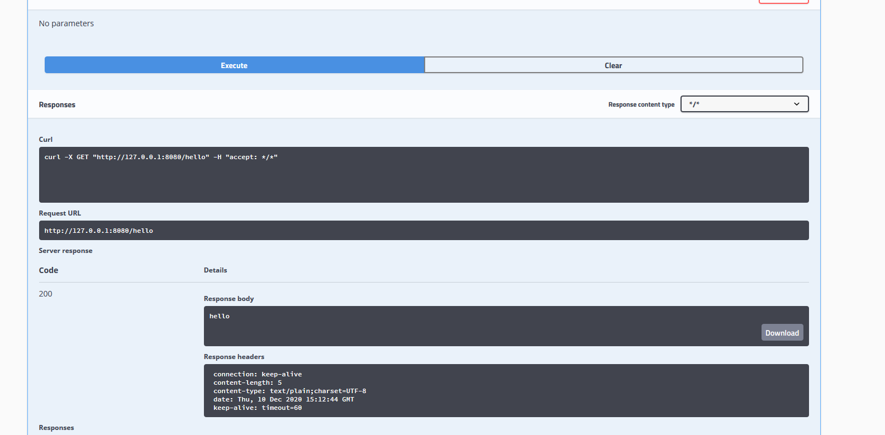
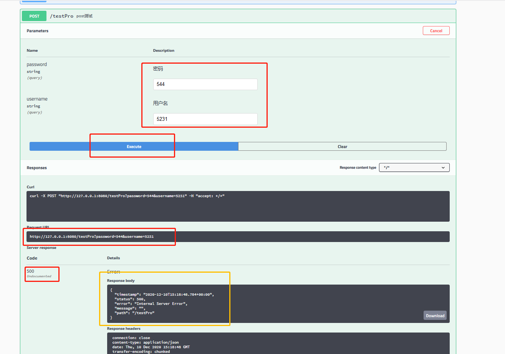

[TOC]

# Swagger

学习目标：

- 了解Swagger的作用和概念
- 了解前后端分离
- 在springboot中集成Swagger

## Swagger简介：

### 1、背景

前后端分离：Vue + SpringBoot

后端时代：前端只用管理静态页面，html=》后端。模板引擎jsp=》后端是主力。

前后端分离时代：

- 后端：后端控制层，服务层，数据访问层【后端团队】
- 前端：前端控制层，视图层【前端团队】
  - 伪造后端数据，json。已经存在了，不需要后端，前端工程依旧能够运行。
- 前后端如何交互？=》API
- 前后端相对独立，松耦合
- 前后端甚至可以部署在不同的服务器上

产生一个问题：前后端集成联调，前后端人员无法做到立即协调，需要尽快解决；

解决方案：

- 首先制定一个schema【计划的提纲】，实时更新最新API，降低集成的风险；
- 早先年：制定word文档
- 前后端分离：
  - 前端测试后端接口：postman
  - 后端提供接口，需要实时更新最新的消息及改动！

### 2、Swagger

- 号称世界上最流行的API框架
- Restful Api 文档在线自动生成工具=>Api文档与API定义同步更新
- 直接运行，可以在线测试API接口
- 支持多种语言，Java、PHP。。。。

官网：https://swagger.io/

在项目中使用Swagger需要springfox；

- swagger2
- ui

## Spring boot集成Swagger

### 1、环境搭建

1. 新建一个spring boot = web项目

2. 导入相关依赖（新版本可能访问地址变化，回退旧版本）

   ~~~xml
   <!-- https://mvnrepository.com/artifact/io.springfox/springfox-swagger2 -->
   <dependency>
       <groupId>io.springfox</groupId>
       <artifactId>springfox-swagger2</artifactId>
       <version>3.0.0</version>
   </dependency>
   
   <!-- https://mvnrepository.com/artifact/io.springfox/springfox-swagger-ui -->
   <dependency>
       <groupId>io.springfox</groupId>
       <artifactId>springfox-swagger-ui</artifactId>
       <version>3.0.0</version>
   </dependency>
   ~~~

   旧版本：

   ```xml
   <!-- https://mvnrepository.com/artifact/io.springfox/springfox-swagger2 -->
   <dependency>
       <groupId>io.springfox</groupId>
       <artifactId>springfox-swagger2</artifactId>
       <version>2.9.2</version>
   </dependency>
   
   
   <!-- https://mvnrepository.com/artifact/io.springfox/springfox-swagger-ui -->
   <dependency>
       <groupId>io.springfox</groupId>
       <artifactId>springfox-swagger-ui</artifactId>
       <version>2.9.2</version>
   </dependency>
   ```

3. 编写一个Hello工程

   ```java
   package com.stefan.swagger.controller;
   
   import org.springframework.web.bind.annotation.RequestMapping;
   import org.springframework.web.bind.annotation.RestController;
   
   @RestController
   public class HelloController {
   
       @RequestMapping(value = "/hello")
       public String hello(){
   
           return "hello";
       }
   }
   ```

4. 配置Swagger，编写config

   ```java
   package com.stefan.swagger.config;
   
   import org.springframework.context.annotation.Configuration;
   import springfox.documentation.swagger2.annotations.EnableSwagger2;
   
   @Configuration
   @EnableSwagger2 // 开启Swagger2
   public class SwaggerConfig {
   }
   ```

5. 测试运行（http://127.0.0.1:8080/swagger-ui.html）新版地址（http://127.0.0.1:8080/swagger-ui/index.html）

   

### 2、配置 Swagger

Swagger的bean实例Docket：在Swagger配置类中添加组件

```java
//配置Swagger的Docket实例
@Bean
public Docket docket(){
    return new Docket(DocumentationType.SWAGGER_2).apiInfo(apiInfo());
}

// 配置swagger信息 = apiInfo
private ApiInfo apiInfo(){
    //作者信息
    Contact contact = new Contact("Klaus", "http://127.0.0.1:8080/files/test.png", "1424245538@qq.com");

    return new ApiInfo(
            "Stefan的SwaggerAPI文档",
            "人生若只如初见",
            "v1.0",
            "http://127.0.0.1:8080/files/test.png",
            contact,
            "Apache 2.0",
            "http://www.apache.org/licenses/LICENSE-2.0",
            new ArrayList());
}
```

测试：



### 3、Swagger配置扫描接口

```java
//配置Swagger的Docket实例
@Bean
public Docket docket(){
    return new Docket(DocumentationType.SWAGGER_2)
        .apiInfo(apiInfo())
        .select()
        // RequestHandlerSelectors配置要扫描接口的方式
        // basePackage指定要扫描的包
        // any()：扫描全部
        // none()：不扫描
        // withClassAnnotation：扫描类上的注解
        // withMethodAnnotation：扫描方法上的注解
        // withClassAnnotation
        .apis(RequestHandlerSelectors.basePackage("com.stefan.swagger"))
        // paths() 过滤什么路径
        //                .paths(PathSelectors.ant("/stefan/**"))
        .build();
}
```

### 4、配置是否启动

```java
// enable是否启动Swagger，如果为false，则Swagger不能在浏览器中访问
@Bean
public Docket docket(){
    return new Docket(DocumentationType.SWAGGER_2)
        .apiInfo(apiInfo())
        .enable(false)
        .select()
        .apis(RequestHandlerSelectors.basePackage("com.stefan.swagger"))
        .build();
}
```

### 5、Swagger在生成环境使用，在发布的时候不适用

- 判断是否是生成环境 flag  = fase，添加environment获取环境

  ```properties
  #application.properties
  server.port=8080
  #spring.profiles.active=dev
  ```

  ```java
  // enable是否启动Swagger，如果为false，则Swagger不能在浏览器中访问
  @Bean
  public Docket docket(Environment environment){
      // 设置要显示的Swagger环境
      Profiles profiles = Profiles.of("dev","test");
      // 获取项目的环境：通过environment.acceptsProfiles判断是否处于自己设定的环境中
      boolean flag = environment.acceptsProfiles(profiles);
      System.out.println(flag);
  
      return new Docket(DocumentationType.SWAGGER_2)
          .apiInfo(apiInfo())
          .enable(flag)
          .select()
          .apis(RequestHandlerSelectors.basePackage("com.stefan.swagger"))
          .build();
  }
  ```

- 注入enable()，如果enable中为false则显示下面的结果

  

### 6、配置API文档分组

#### 6.1、分组：`.groupName("wangyunjie")`

```java
@Bean
public Docket docket(Environment environment){

    return new Docket(DocumentationType.SWAGGER_2)
        .apiInfo(apiInfo())
        .groupName("wangyunjie")
        .apis(RequestHandlerSelectors.basePackage("com.stefan.swagger"))
        .build();
}
```



#### 6.2、如何配置多个分组

使用多个Docket实例

```java
@Bean
public Docket docket2(){
    return new Docket(DocumentationType.SWAGGER_2).groupName("hhhhhh");
}

@Bean
public Docket docket3(){
    return new Docket(DocumentationType.SWAGGER_2).groupName("ttttt");
}

@Bean
public Docket docket4(){
    return new Docket(DocumentationType.SWAGGER_2).groupName("jjjjj");
}
```



### 7、实体类配置

1. 编写实体类，无set，get方法，参数扫描不到

   ```java
   package com.stefan.swagger.pojo;
   
   public class User {
   
       private String username;
   
       private String password;
   
       public String getUsername() {
           return username;
       }
   
       public void setUsername(String username) {
           this.username = username;
       }
   
       public String getPassword() {
           return password;
       }
   
       public void setPassword(String password) {
           this.password = password;
       }
   }
   ```

2. 编写接口，返回值中需要有实体类

   ```
   // 只要我们的接口中，返回值中存在实体类，就会被扫描到Swagger中
   @PostMapping(value = "/user")
   public User user(){
       return new User();
   }
   ```

3. 测试

   

4. @ApiModel、Api：实体类上面添加注解，文档给实体类加注释

   ```java
   //@Api(注释)或者
   @ApiModel("用户实体类")
   public class User {
   ```

   

5. @ApiModelProperty：属性上面添加注解，给属性加注释

   ```java
   @ApiModelProperty("用户名")
   private String username;
   
   @ApiModelProperty("密码")
   private String password;
   ```

   

6. @ApiOperation：接口上加注解，接口注释

   ```java
   // ApiOperation不是放在类上的，是放在方法上面的
   @ApiOperation("hello方法")
   @GetMapping("/hello2")
   public String hello2(String str){
       return "hello" + str;
   }
   ```

   

7. @ApiParam：加在参数前，参数注释

   ```java
   // ApiOperation不是放在类上的，是放在方法上面的
   @ApiOperation("hello方法")
   @GetMapping("/hello2")
   public String hello2(@ApiParam("用户名") String str){
       return "hello" + str;
   }
   ```

   

### 8、自带测试

#### 测试一：get

1. 点击try it out进行测试

   

2. 点击execute执行

   

#### 测试二：post

1. 方法：

   ~~~java
   @ApiOperation("post测试")
   @PostMapping("/testPro")
   public User testPro(@ApiParam("一个用户") User user){
       return user;
   }
   ~~~

2. 测试

   

#### 测试三：报错

1. 方法：

   ```java
   @ApiOperation("post测试")
   @PostMapping("/testPro")
   public User testPro(@ApiParam("一个用户") User user){
       int i = 5/0;
       return user;
   }
   ```

2. 测试：

   

### 总结

- 我们可以利用Swagger给一些难以理解的属性或者接口，添加注释信息
- 接口文档实时更新
- 可以在线测试
- 大公司使用，优秀的工具
- 注意点：正式发布的时候，关闭Swagger