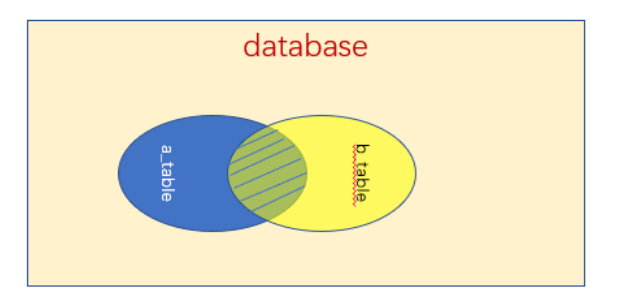
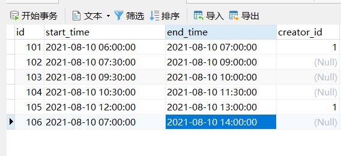

# 面试总结


### Mybatis 中使用xml文件接口的原理

1. 读取配置文件mybatis-config.xml, 
2. 然后创建sqlSessionFactoryBuilder对象,
3. 再创建SqlSessionFactory工厂, 
4. 根据工厂再创建sqlSession会话, 这个sqlSession就相当于是JDBC中的connection链接对象,
5. 然后再根据sqlSession.getMapper("UserMapper.xml") 文件,获取全类名,然后通过反射创建 UserMapper的代理对象, 
6. 使用代理完成对接口的实现


### SpringIOC的原理

1. 加载xml配置文件xml   ClassPathXmlApplicationContext, 并创建beanFactory工厂
2. 再根据配置文件中的bean标签进行扫描获取, 得到有唯一的class全类名
3. 使用反射创造出该对象, 


### SpringMVC中对于参数的获取

1. 若表单提交的name与方法处理的**形参**名称不同,则是用***@RequestParam***注解,
2. **对象参数接收参数值**
   * *使用对象接收参数,对象的类中的属性值名称需与提交的name值相同, 则SpringMVC自动调用该类的无参构造方法,根据传递的参数调用对应的set方法用以赋值,完成对象传参.*
3. 若前端传递参数为json, 则使用@requestBody 进行解析, 定义对象来接收
4. 返回json数据使用 @responseBody 注解


### 数据库中关于多表查询

[mysql多表查询](https://blog.csdn.net/plg17/article/details/78758593)

1. #### **内连接**

   关键字：inner join on

   ```sql
   语句：select * from a_table a inner join b_table b on a.a_id = b.b_id;
   select * from a_table a, b_table b where a.a_id = b.b_id;  (简写)
   ```

   说明：组合两个表中的记录，返回关联字段相符的记录，也就是返回两个表的交集（阴影）部分。

   

2. #### 左连接(左外链接)

   **关键字：left join on / left outer join on**

   ```sql
   语句：select * from a_table a left join b_table b on a.a_id = b.b_id;
   ```
   

说明：

left join 是left outer join的简写，它的全称是左外连接，是外连接中的一种。

左(外)连接，左表(a_table)的记录将会全部表示出来，而右表(b_table)只会显示符合搜索条件的记录。右表记录不足的地方均为NULL。


3. #### 右连接(右外连接)

   **关键字：right join on / right outer join on**

   ```sql
   语句：select * from a_table a right outer join b_table b on a.a_id = b.b_id;
   ```

   说明：
   right join是right outer join的简写，它的全称是右外连接，是外连接中的一种。
   与左(外)连接相反，右(外)连接，左表(a_table)只会显示符合搜索条件的记录，而右表(b_table)的记录将会全部表示出来。左表记录不足的地方均为NULL。

   

### 对于Java中List集合中, 遍历中如何安全的删除元素

因为list的底层是数组, 在进行增删时的原理就是创建一个新的数组,将其余元素复制过去, 然遍历的时候删除有很高的安全隐患

所以, 只能使用iterator迭代器进行删除 hashNext()   next()

```java
    /** 
     * 使用Iterator的方式可以顺利删除和遍历 
     */  
    public void iteratorRemove() {  
        List<Student> students = this.getStudents();  
        System.out.println(students);  
        Iterator<Student> stuIter = students.iterator();  
        while (stuIter.hasNext()) {  
            Student student = stuIter.next();  
            if (student.getId() % 2 == 0)  
                stuIter.remove();//这里要使用Iterator的remove方法移除当前对象，如果使用List的remove方法，则同样会出现ConcurrentModificationException  
        }  
        System.out.println(students);  
    }  
```


### Java集合中为什么set是不重复的

​	set集合会让两两对象，先调用自己的hashCode()方法得到彼此的哈希值(所谓的内存地址)
​	然后比较两个对象的哈希值是否相同，如果不相同则直接认为两个对象不重复。
​	如果哈希值相同，会继续让两个对象进行equals比较内容是否相同，如果相同认为真的重复了
​	如果不相同认为不重复。


### hashCode 与equals方法

 	**hashCode()方法和equals()方法的作用其实一样，在Java里都是用来对比两个对象是否相等一致。**

```xml
那么equal()既然已经能实现对比的功能了，为什么还要hashCode()呢？因为重写的equals()里一般比较的比较全面

比较复杂，这样效率就比较低，而利用hashCode()进行对比，则只要生成一个hash值进行比较就可以了，效率很高。

     那么hashCode()既然效率这么高为什么还要equal()呢？ 因为hashCode()并不是完全可靠，有时候不同的对象他们生成的hashcode也会一样（生成hash值得公式可能存在的问题），所以hashCode()只能说是大部分时候可靠，并不是绝对可靠，所以我们可以得出：

 1.equals()相等的两个对象他们的hashCode()肯定相等，也就是用equals()对比是绝对可靠的。

 2.hashCode()相等的两个对象他们的equals()不一定相等，也就是hashCode()不是绝对可靠的。

      所有对于需要大量并且快速的对比的话如果都用equals()去做显然效率太低，所以解决方式是，每当需要对比的时候，首先用hashCode()去对比，如果hashCode()不一样，则表示这两个对象肯定不相等（也就是不必再用equals()去再对比了）,如果hashCode()相同，此时再对比他们的equals()，如果equals()也相同，则表示这两个对象是真的相同了，这样既能大大提高了效率也保证了对比的绝对正确性！

总结如下：
1.若重写了equals(Object obj)方法，则有必要重写hashCode()方法。

2.若两个对象equals(Object obj)返回true，则hashCode（）也必须返回相同的int数。

3.若两个对象equals(Object obj)返回false，则hashCode（）不一定返回不同的int数。

4.若两个对象hashCode（）返回相同int数，则equals（Object obj）不一定返回true。

5.若两个对象hashCode（）返回不同int数，则equals（Object obj）一定返回false。

6.同一对象在执行期间若已经存储在集合中，则不能修改影响hashCode值的相关信息，否则会导致内存泄露问题。

7.hashcode方法只有在集合中用到，将对象放入到集合中时，首先判断要放入对象的hashcode值与集合中的任意一个元素的hashcode值是否相等，如果不相等直接将该对象放入集合中。如果hashcode值相等，然后再通过equals()方法判断要放入对象与集合中的任意一个对象是否相等，如果equals()判断不相等，直接将该元素放入到集合中，否则不放入。

8.equals()方法是用于比较对象的内容是否相等。

```


### 奇怪的try..catch..finally

```java
package com.atguigu.controller;

public class A {
    public static void main(String[] args) {
        String add = add(2);
        System.out.println(add);
    }

    public static String add(int a) {
        try {
            System.out.println("---a" + a);
            return "--try";
        }catch (Exception e){
            e.printStackTrace();
        }finally {
            System.out.println("--final");
        }
        return "--return";
    }
}


输出结果：
    
    ---a2
	--final
	--try

```


### 类方法和实例方法

```java
public class Test {

    private int a = 5;
    private static int b = 10;

    public static void yiStatic()
    {
//        a = 10;//静态方法无法访问非静态成员变量
        System.out.println("yiStatic");
    }

    public void yiInstance()
    {
        a = 10;
        b = 5;//非静态方法可以访问静态变量
        System.out.println("yiInstanc");
    }

    public void yiInstance2()
    {
        yiStatic();//非静态方法可以访问非静态方法
        yiInstance();//非静态方法可以访问静态方法
        System.out.println("yiInstance2");
    }

    public static void yiStatic2()
    {
        yiStatic();//静态方法可以访问静态方法
//        yiInstance();//静态方法不可以访问非静态方法
        System.out.println("yiStatic2");
    }
}


```

通过这么测试我们发现，

**实例方法**即非静态方法可以访问类中的**任何**变量和方法（包括静态和非静态的），

而**静态方法中只能**访问静态变量和静态方法。

JVM中： 

**实例方法**
在jm加载类的字节码文件到memory中时，并没有把类的所有方法都立即分配入口地址，例如实例方法即非静态方法，只有当我们创建
对象时，类的实例方法才会被分配访问地址。同时，只要创建类的第一个对象时， 类的实例方法的入口地址就会被分配，之后再创建此对象时不再给实例方法的分配新的地址，而是共享第一个对象被创建时分配的实例方法的入口地址, 并且，只有当类的最后一个实例对象被销毁时才会将地址回收。

**类方法(静态方法)**
在jvm加载类的字节码文件到memory中时，方法就会被分配入口地址，所以,方河以通过类来直接访问，而不需要对象创建后才能访问，而且由此知道，类方法的入口地址分配比实例方法要早，由此就可以解释上述程序中，为什么静态方法无法访问非静态变量和实例方法:

**a.类方法中不能访问非静态变量和实例方法**
因为非静态成员变量跟实例方法样,只有在对象创建时才分配入口地址，而静态方法的入口地址分配又比实例方法早，导致此时非静态
成员变量和实例方法还没有被分配到内存，所以无法访问

**b.类方法中也不能访问super和this关键字**
显然,我们知道this是指代本类的对象，super是出现继承时指向父类的对象，显然两者都依托于类的实例对象的创建，因为,静态方法中
不能访问。
c.实例方法没有.上述限制
显然通过实例方法和类方法分配内存的先后顺序显然知道


### spring得IOC优势

1. 以前编码不同类之间相互调用需要new出对象来调用，new对象比较消耗资源，而且有可能new出一堆只使用一次的对象，造成内存的损耗，使用ioc的依赖注入，在spring容器初始化的时候就全部new出对象，使用注入方式，方便调用，也节省资源

2. 不同类之间相互调用，造成编码的耦合度太高，spring使用xml文件+工厂模式，很好的解耦。 

3. spring的ioc内部原理是 读取xml文件的全类名，使用反射的方式，通过工厂模式造出，默认单例

   


### == 与 equals 方法

​	**java当中的数据类型和“==”的含义：**

- 基本数据类型（也称原始数据类型） ：byte,short,char,int,long,float,double,boolean。
  - 他们之间的比较，应用双等号（==）,比较的是他们的值。
- 引用数据类型：当他们用（==）进行比较的时候，
  - 比较的是他们在内存中的存放地址（确切的说，是**堆内存**地址）。

**equals()方法介绍：**

​	JAVA当中所有的类都是继承于Object这个超类的，在Object类中定义了一个equals的方法，equals的源码是这样写的：

```java
public boolean equals(Object obj) {
    //this - s1
    //obj - s2
    return (this == obj);
}
```

可以看到，这个方法的初始默认行为是比较对象的内存地址值，一般来说，意义不大。

所以，在一些类库当中这个方法被重写了，如String、Integer、Date。

在这些类当中equals有其自身的实现（一般都是用来比较对象的成员变量值是否相同），而不再是比较类在堆内存中的存放地址了。

所以说，对于复合数据类型之间进行equals比较，在没有覆写equals方法的情况下，他们之间的比较还是内存中的存放位置的地址值，跟双等号（==）的结果相同；如果被复写，按照复写的要求来。

**我们对上面的两段内容做个总结吧**：

 **== 的作用：**
　　基本类型：比较的就是值是否相同
　　引用类型：比较的就是地址值是否相同
**equals 的作用:**
　　引用类型：默认情况下，比较的是地址值。
注：不过，我们可以根据情况自己重写该方法。一般重写都是自动生成，比较对象的成员变量值是否相同


### 时间冲突判断


> 业务场景： 会议室的预定
>
>  预定要进行时间冲突判断。

```java
 /**
*                              时间冲突规则：
*
*                  a                                   b
*
*  -------------startTime---------------------------endTime--------------------------
*   "s1...e1"                "s2.......e2"                       "s3....e3"
*          "s4...............e4"          "s5.....................e5"
*    "s6.............................................................e6"
*
*    s1 s3 可放行，其余均被占用
*
*    可写 两种sql
*
*    1. select * from xxx where not ( (endTime < a) or (startTime > b) )
*    2. select * from xxx where endTime > a and startTime < b
*
*
*/
```


​			`模拟数据`





```sql
#														时间冲突规则
#
#						     a                                   b
#
# -------------startTime---------------------------endTime--------------------------
#        "s1...e1"                "s2.......e2"                     "s3....e3"
#          "s4...............e4"          "s5.....................e5"
#          "s6.............................................................e6"
#           
#            s1 s3 可放行，其余均被占用
#        
#      可写 两种sql
#        
#       1. select * from xxx where not ( (endTime < a) or (startTime > b) )
#       2. select * from xxx where endTime > a and startTime < b


# 第一种：

# 传入两个时间
select id,start_time,end_time,creator_id from hv_conference_records 
where not (end_time < '2021-08-10 08:00:00' or start_time > '2021-08-10 11:00:00' )
# 只传入开始时间
select id,start_time,end_time,creator_id from hv_conference_records
where not (end_time < '2021-08-10 08:00:00' )
# 只传入结束时间
select id,start_time,end_time,creator_id from hv_conference_records  
where not (start_time > '2021-08-10 11:00:00' )


# 第二种方式
select id,start_time,end_time,creator_id from hv_conference_records 
where end_time > '2021-08-10 08:00:00' and start_time < '2021-08-10 11:00:00'

# 只传入开始时间
select id,start_time,end_time,creator_id from hv_conference_records 
where end_time > '2021-08-10 08:00:00'

#只传入结束时间
select id,start_time,end_time,creator_id from hv_conference_records 
where start_time < '2021-08-10 11:00:00'

## 有关临界值的测试，要不包含临界值才对，以止时间冲突
select id,start_time,end_time,creator_id from hv_conference_records 
where end_time > '2021-08-10 07:00:00' and start_time < '2021-08-10 07:30:00'
```


>  总结：
>
> ​			 若发现业务中存在这样子的冲突排解，使用循环排除并不是良好的选择，
>
> ​			 当由此种顾虑时，应思考sql的可能性， 从根本上解决问题。
>
> ​			
>
> 要自己设想可能性，然后使用sql实验验证，从而提高代码质量。	
>
> 